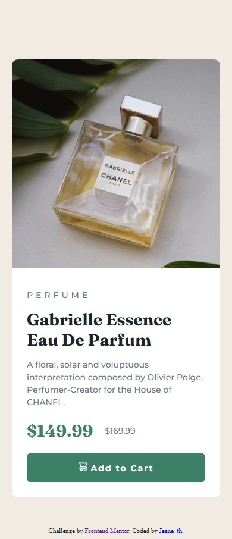
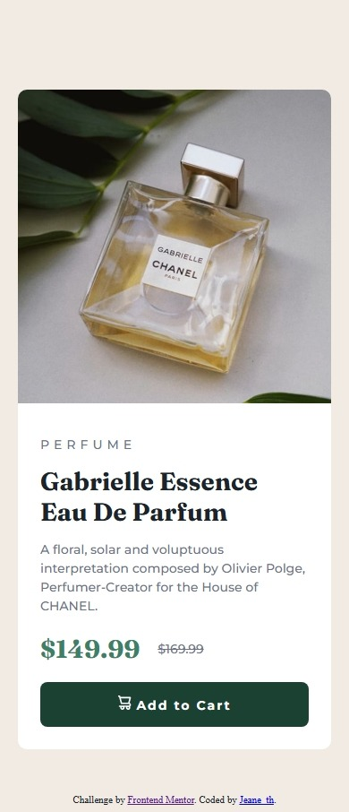

# Frontend Mentor - Componente de vista previa de producto

Esta es mi solución al reto **Product preview card component**  [Product preview card component](https://www.frontendmentor.io/challenges/product-preview-card-component-GO7UmttRfa) de Frontend Mentor.  
El proyecto fue desarrollado usando HTML y CSS, cuidando una estructura clara y un diseño responsive.

## 📌 Descripción general

### 🎯 El reto

Los usuarios deben poder:

- Ver el diseño óptimo según el tamaño de su pantalla
- Ver los estados hover en los elementos interactivos

### 📷 Captura de pantalla


| Desktop | Mobile | Mobile-hover|
|-------------------------------|------------------------------|-------------------------|
|   |   |    |


### 🔗 Enlaces

- URL de la solución: https://github.com/jeane-th/fm5_componente_card_vista_producto
- Sitio en vivo: https://jeane-th.github.io/fm5_componente_card_vista_producto

## 🛠️ Proceso de desarrollo

### 🚀 Tecnologías usadas

- HTML5 semántico
- CSS
- Flexbox
- Metodología BEM
- Enfoque Mobile First

### 📚 Lo que aprendí

En este proyecto practiqué:

- Organización del HTML usando etiquetas semánticas
- Uso de la metodología BEM para nombrar clases
- Creación de layouts responsive con Flexbox
- Mejora de la legibilidad y mantenimiento del código

Ejemplo de clases usando BEM:

```html
<div class="card__price">
  <span class="card__price-current">$149.99</span>
  <span class="card__price-old">$169.99</span>
</div>
